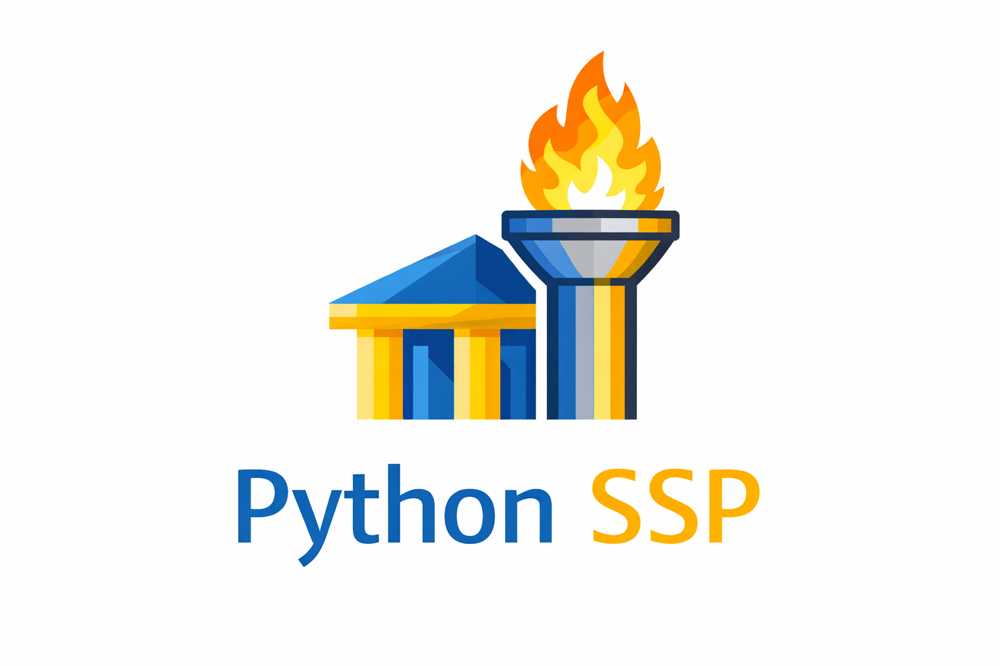

# pySSP



`pySSP` is a Python/PyQt5 soundboard application inspired by the Sports Sounds Pro workflow.

It includes:
- Group/page/button navigation (`A`-`J`, 18 pages each, 48 buttons per page)
- `.set` file loading/saving
- Audio playback, cue points, playlist/shuffle options, and transport controls
- An optional Flask-based Web Remote (browser UI + HTTP API)

Python SSP is an independent project and has no affiliation with, endorsement by, or connection to the official Sports Sounds Pro.


## Project status

This project is actively developed and experimental. Validate behavior in your own environment before production use.

## Requirements

- Python `3.12` (see `Pipfile`)
- Windows is the primary target (batch launch/build scripts are provided)
- Audio playback dependencies from `requirements.txt`

## Quick start

### Option 1: plain venv + pip

```powershell
python -m venv .venv
.venv\Scripts\python -m pip install -r requirements.txt
.venv\Scripts\python main.py
```

### Option 2: provided launch scripts

- `run_ssp_venv.bat`: run app from `.venv`
- `run_ssp_cleanstart_venv.bat`: run with `--cleanstart` (resets settings)

## Command-line flags

- `--cleanstart` or `/cleanstart`
- `-debug`, `--debug`, or `/debug`

## Features

### UI model

- 10 groups (`A`-`J`)
- 18 pages per group
- 48 buttons per page (6x8)

### Set compatibility

- Load and save Sports Sounds Pro  `.set` files
- Page names, page colors, playlist/shuffle flags, button metadata, cue data

### Playback and control

- Play, pause, resume, stop, force stop, rapid fire, play next
- Talk mode, multi-play, fade in/out, crossfade toggles
- Cue page and per-button cue point editing
- Timecode display and timeline behavior options

### Timecode output

- MTC and LTC output

### Right-click button operations

- Add/replace sound, remove sound
- Highlight/lock/marker/copy-to-cue toggles
- Verify sound file, cue tools

### Web Remote

- Optional browser UI and JSON HTTP API (default port `5050`)
- Toggle in `Options -> Web Remote`
- API docs in `apidocs.md`

### Settings and localization

- Persistent settings in `%APPDATA%\pySSP\settings.ini`
- English and Simplified Chinese UI localization

## Web Remote + Companion

When enabled, open:

- `http://<your-ip>:<port>/` for browser remote UI
- `http://<your-ip>:<port>/api/query` for state JSON

The Bitfocus Companion module is included at `companion-modules\pyssp`.

To use Companion with `pySSP`, Web Remote must be enabled in `Options -> Web Remote`.

See `apidocs.md` for endpoint details and payload formats.

## Tests

Run unit tests with:

```powershell
python -m pytest
```

## Build executable (PyInstaller)

Use:

```bat
build_pyinstaller.bat
```

This script:
- Ensures a Python 3.12 `pipenv` environment
- Installs dependencies
- Builds `dist\pySSP\pySSP.exe`
- Generates helper launchers
- `dist\pySSP\pySSP_cleanstart.bat`
- `dist\pySSP\pySSP_debug.bat`

## License

`pySSP` is licensed under GPL-3.0. See `LICENSE`.
