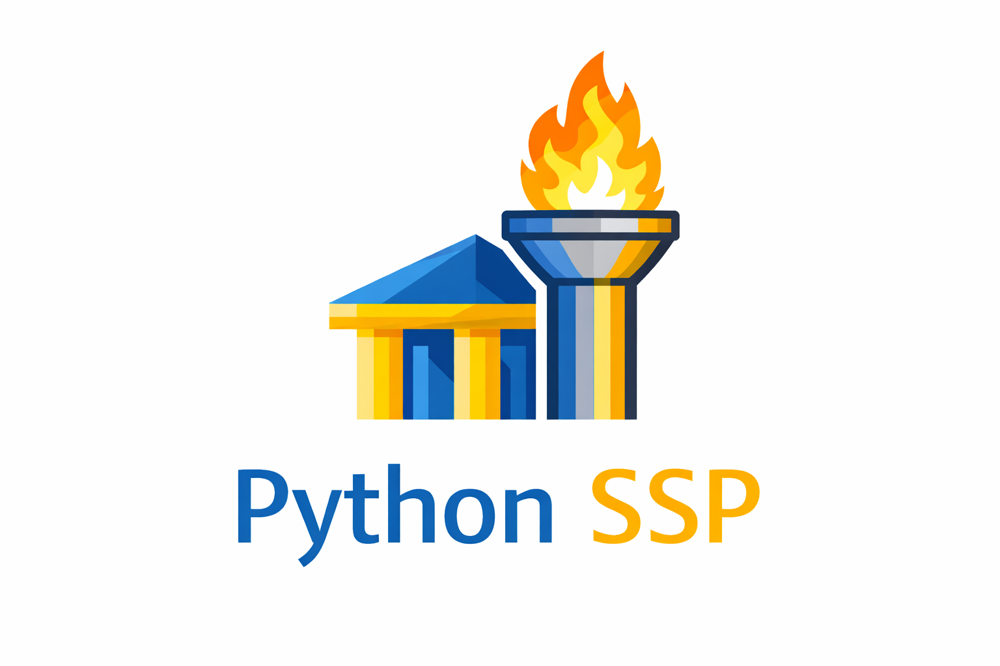
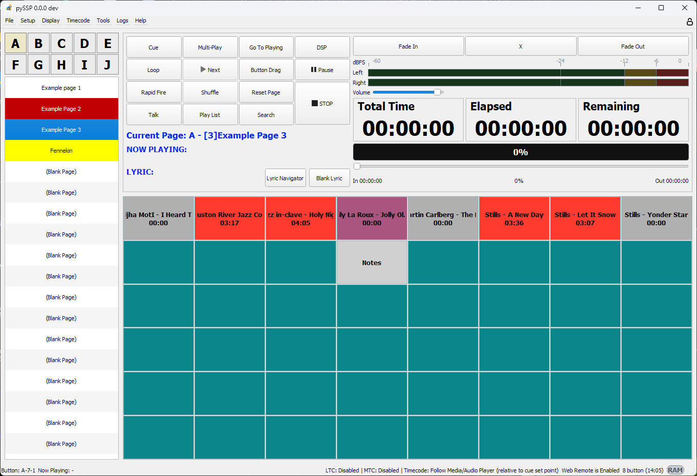

# pySSP



`pySSP` is a Python/PyQt5 soundboard application inspired by the Sports Sounds Pro workflow.

It includes:
- Group/page/button navigation (`A`-`J`, 18 pages each, 48 buttons per page)
- `.set` file loading/saving
- Audio playback, cue points, playlist/shuffle options, and transport controls
- An optional Flask-based Web Remote (browser UI + HTTP API)

Python SSP is an independent project and has no affiliation with, endorsement by, or connection to the official Sports Sounds Pro.



## Project status

This project is actively developed and experimental. Validate behavior in your own environment before production use.

## Baidu Netdisk release download for user in Mainland China

链接: https://pan.baidu.com/s/1xFaeUc9y4ClNr3DfFCGLFg?pwd=5516 提取码: 5516

## Requirements

- Python `3.12` (see `Pipfile`)
- Windows is the primary target (batch launch/build scripts are provided)
- Audio playback dependencies from `requirements.txt`

## Quick start

### Option 1: plain venv + pip

```powershell
python -m venv .venv
.venv\Scripts\python -m pip install -r requirements.txt
.venv\Scripts\python main.py
```

### Option 2: provided launch scripts

- `run_ssp_venv.bat`: run app from `.venv`
- `run_ssp_cleanstart_venv.bat`: run with `--cleanstart` (resets settings)
- `run_ssp_venv.sh`: macOS/Linux launcher from `.venv` (`./run_ssp_venv.sh`)

## Command-line flags

- `--cleanstart` or `/cleanstart`
- `-debug`, `--debug`, or `/debug`

## Features

### UI model

- 10 groups (`A`-`J`)
- 18 pages per group
- 48 buttons per page (6x8)

### Set compatibility

- Load and save Sports Sounds Pro  `.set` files
- Page names, page colors, playlist/shuffle flags, button metadata, cue data
- Custom cue points are saved by pySSP as `pysspcuestartX` / `pysspcueendX` time fields.
- Important: after a set is saved in pySSP with custom cues, those custom cues will not work in original Sports Sounds Pro.
- On load, pySSP still reads legacy `csX` / `ceX` cue fields and converts them automatically.

### Playback and control

- Play, pause, resume, stop, force stop, rapid fire, play next
- Talk mode, multi-play, fade in/out, crossfade toggles
- Cue page and per-button cue point editing
- Timecode display and timeline behavior options
- MIDI input learning, quick actions, and Launchpad page-mapping helper for current-page sound buttons

### Timecode output

- MTC and LTC output

### Right-click button operations

- Add/replace sound, remove sound
- Highlight/lock/marker/copy-to-cue toggles
- Verify sound file, cue tools

### Web Remote

- Optional browser UI and JSON HTTP API (default port `5050`)
- Toggle in `Options -> Web Remote`
- API docs in `docs/source/web_remote_api.md`

### Settings and localization

- Persistent settings in `%APPDATA%\pySSP\settings.ini`
- English and Simplified Chinese UI localization

## Web Remote + Companion

When enabled, open:

- `http://<your-ip>:<port>/` for browser remote UI
- `http://<your-ip>:<port>/api/query` for state JSON

The Bitfocus Companion module is included at `companion-modules\pyssp`.

To use Companion with `pySSP`, Web Remote must be enabled in `Options -> Web Remote`.

See `docs/source/web_remote_api.md` for endpoint details and payload formats.

## Tests

Run unit tests with:

```powershell
python -m pytest
```

Helper scripts are also provided:

- `run_tests_venv.sh` / `run_test_venv.sh`
- `run_tests_venv.bat` / `run_test_venv.bat`

Monkey tests are included in the default `pytest` run.

Auto-test implementation notes and roadmap:

- `docs/source/dev_notes/auto_test_plan.md`

## Build executable (PyInstaller)

Windows:

```bat
build_pyinstaller.bat
```

macOS:

```bash
./build_pyinstaller_mac.sh
```

These scripts:
- Ensures a Python 3.12 `pipenv` environment
- Installs dependencies
- Builds the application with PyInstaller
- Generates helper launchers for cleanstart/debug

Build outputs:
- Windows: `dist\pySSP\pySSP.exe`, `dist\pySSP\pySSP_cleanstart.bat`, `dist\pySSP\pySSP_debug.bat`
- macOS: `dist/pySSP.app`, `dist/pySSP_cleanstart.app`, `dist/pySSP_debug.app`

## FFmpeg / LGPL Compliance

- `pySSP` uses FFmpeg for media decode support.
- Current release build scripts collect `imageio_ffmpeg` data (`--collect-data "imageio_ffmpeg"`), which bundles the FFmpeg binary provided by that package.
- This repository does not include FFmpeg source code.
- Release artifacts may include unmodified FFmpeg binaries provided by `imageio-ffmpeg`.
- Current build scripts do not enforce an automatic LGPL/GPL flag guard; verify the bundled FFmpeg build configuration during release preparation.
- Follow `docs/source/ffmpeg_lgpl_compliance.md` for release requirements.

Download-page notice text (for any page that links to your app download):

`This software uses code of <a href=http://ffmpeg.org>FFmpeg</a> licensed under the <a href=http://www.gnu.org/licenses/old-licenses/lgpl-2.1.html>LGPLv2.1</a> and its source can be downloaded <a href=link_to_your_sources>here</a>`

## Build DMG (macOS)

Use:

```bash
./build_dmg_mac.sh
```

This script:
- Packages `pySSP.app`, `pySSP_cleanstart.app`, and `pySSP_debug.app`
- Places them in a `pyssp/` folder inside the DMG
- Uses `logo.png` as the DMG background
- Adds `INSTALL.txt` with drag-to-Applications instructions

Output:
- `dist/pySSP-macOS.dmg`

## License

`pySSP` is licensed under GPL-3.0. See `LICENSE`.
