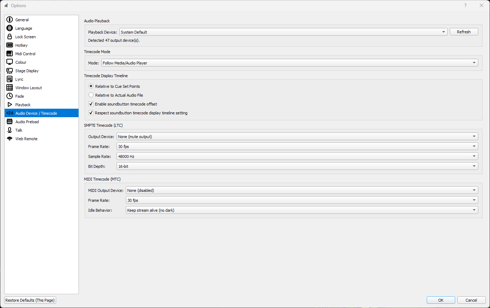

# Audio Device and Timecode

This page covers output device selection and timecode configuration.

## Audio Device

Choose your playback output device from Options/Settings so pySSP routes audio to the desired hardware.

Settings page:

## Timecode Panel

The Timecode panel shows active output and mode state for timecode features.

## Timecode Timeline Mode

Timecode display can use one of two timeline references:

- `Relative to Cue Set Points`
- `Relative to Actual Audio File`

These settings are independent from the Main Transport timeline mode.

You can also enable:

- `Soundbutton timecode offset`
- `Respect soundbutton timecode display timeline setting`

## Stage Display and Timing Context

Stage Display can be used together with playback and timecode workflows for live operations.

