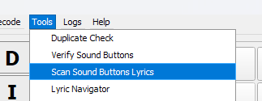
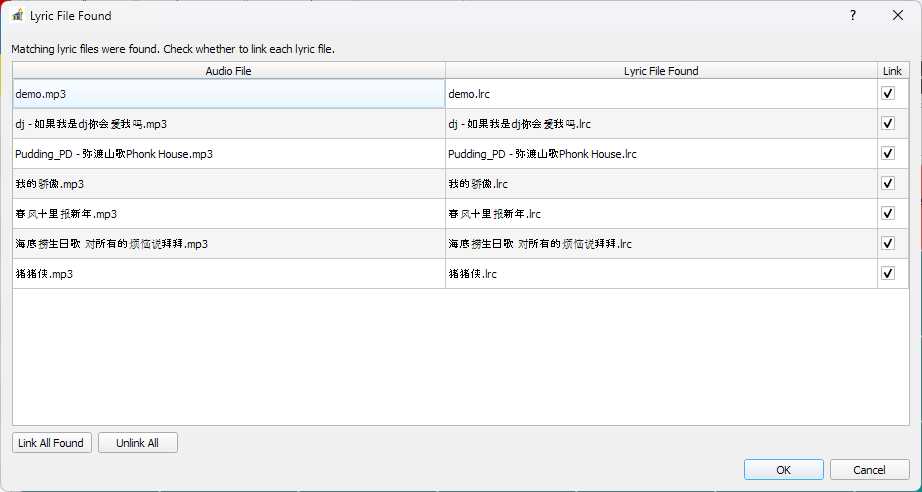
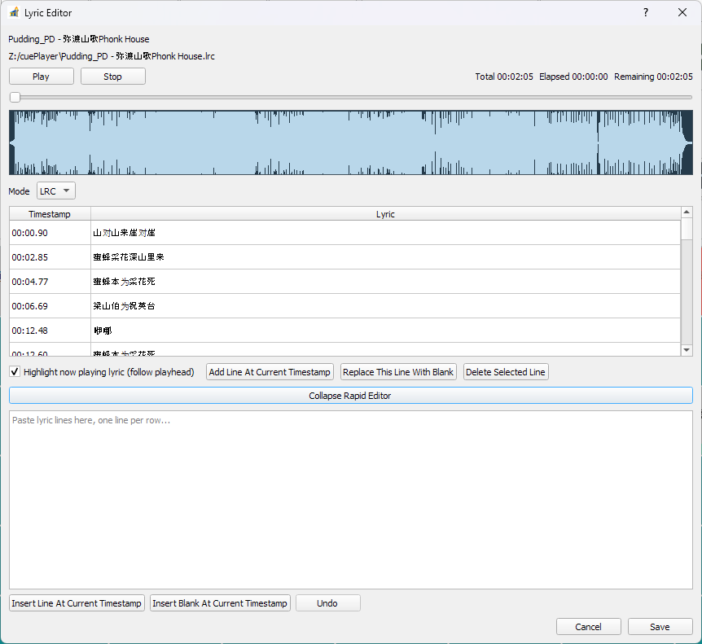
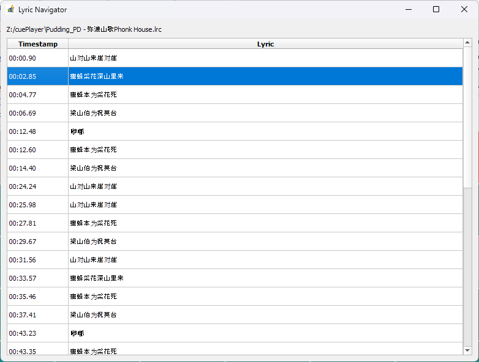
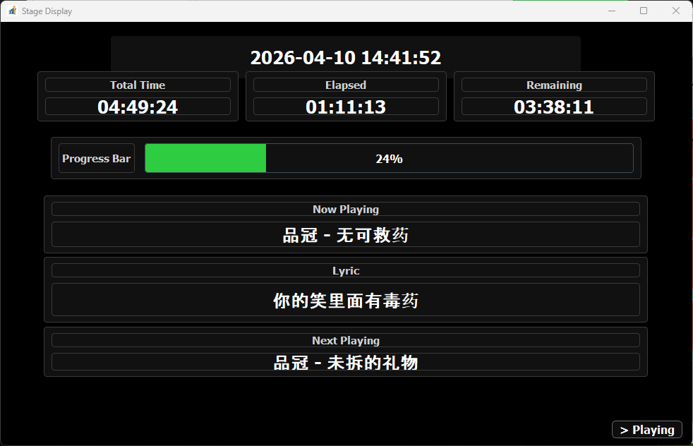
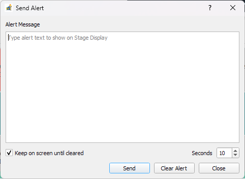
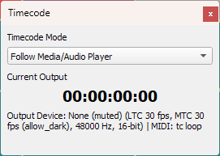

# Lyric, Stage Display, and Timecode

This page summarizes lyric workflow, stage display behavior, and how timecode works during playback.

## Lyric Workflow

When assigning audio to a sound button, pySSP can scan for matching lyric files.

If a lyric file is found, pySSP shows the match/selection window.

You can edit lyric timing/text in the lyric editor, including rapid edit tools.

For runtime navigation, use Lyric Navigator to jump to lines/positions quickly.

## Stage Display

Stage Display can show live playback context (for example: song name, lyric, elapsed/remaining, progress, and alerts).

Alerts can be pushed to the Stage Display while the set is running.

## How Timecode Works

Timecode behavior is controlled by `Audio Device / Timecode` settings and reflected in the Timecode panel.

Core flow:

- Choose a `Timecode Mode`:
  - `All Zero`: output stays at zero.
  - `Follow Media/Audio Player`: output follows current playback position.
  - `System Time`: output follows wall-clock time.
  - `Pause Sync (Freeze While Playback Continues)`: freezes timecode while audio can continue.
- Choose `Timecode Display Timeline` reference:
  - `Relative to Cue Set Points`
  - `Relative to Actual Audio File`
- Optional per-button behavior:
  - `Enable soundbutton timecode offset` applies button-level offsets.
  - `Respect soundbutton timecode display timeline setting` lets a sound button override global timeline reference.
- Select output type/device:
  - `SMPTE Timecode (LTC)` output target plus frame/audio format.
  - `MIDI Timecode (MTC)` MIDI output and frame rate.

In live operation, this means lyric navigation, Stage Display, and timecode can all stay aligned to either cue-relative timing or absolute audio-file timing, based on your timeline settings.
