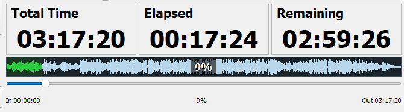
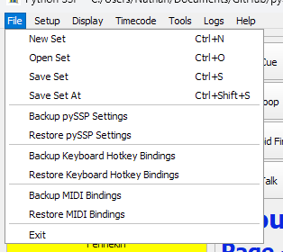
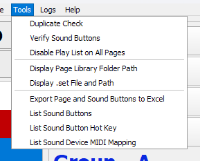
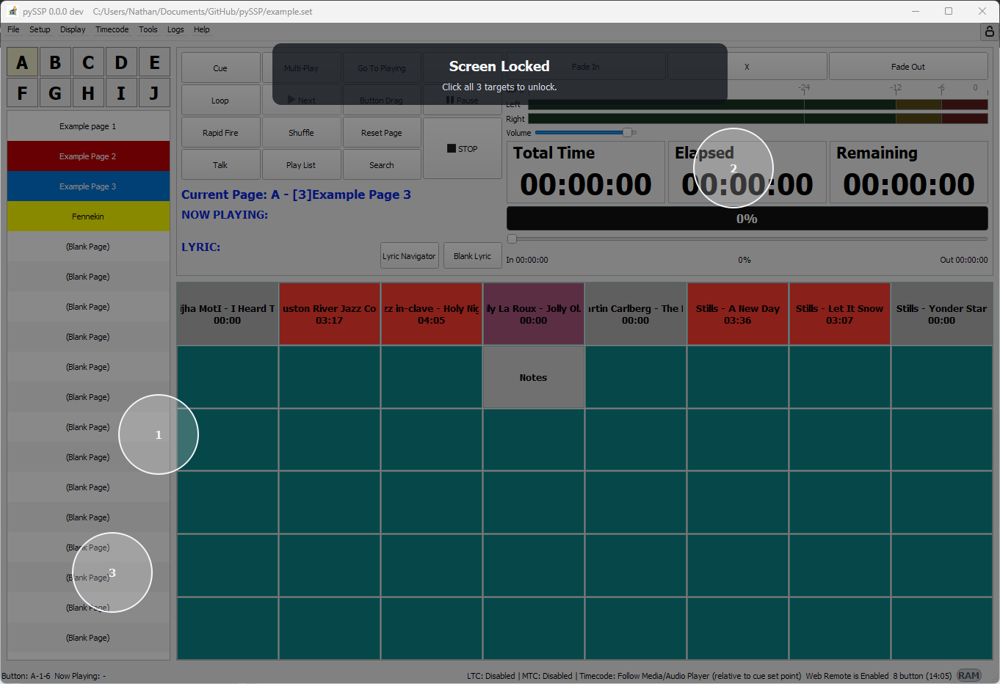
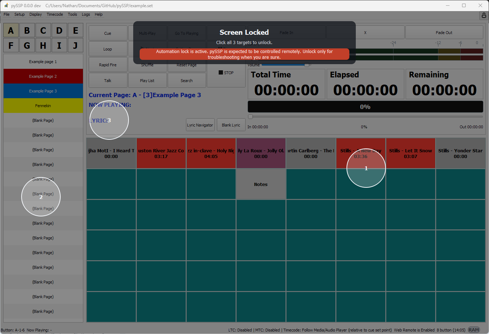

# Main Window

The main window is the primary workspace for loading a set and triggering sounds.

## Main Areas

- Menu bar: `File`, `Setup`, `Display`, `Timecode`, `Tools`, `Logs`, `Help`.
- Group buttons: `A` to `J`.
- Page list/controls: page selection for the active group.
- Sound grid: 48 sound buttons per page.
- Transport and mode controls: playback and behavior buttons.
- Fade and level controls: fade modes, volume, and seek.
- Lock screen control: lock/unlock status and automation lock visibility.

## Main Control Buttons

| Button | Runtime behavior |
| --- | --- |
| `Cue` | Toggles Cue mode. In Cue mode, page list switches to Cue page view. Right-click menu provides `Clear Cue`. |
| `Multi-Play` | Allows multiple active players. When enabled, it disables `Play List`/`Shuffle` and forces crossfade (`X`) off. Max count behavior follows Playback settings. |
| `DSP` | Opens DSP window and applies DSP config to active players. |
| `Go To Playing` | Navigates to the group/page of currently playing slot. If nothing is playing, shows notice. |
| `Loop` | Toggles loop-enabled state used by playlist/next behavior. Loop semantics follow Playback setting (`Loop List`/`Loop Single`). |
| `Next` | Triggers next candidate by current selection rules; enabled only while playback is active and a next candidate exists. |
| `Button Drag` | Enables button drag/move mode. While enabled, clicking sound buttons does not play audio. Disabled automatically during playback. |
| `Pause` | Toggles pause/resume. In Multi-Play it pauses/resumes all active players. Label switches between `Pause` and `Resume`. |
| `Rapid Fire` | Picks random candidate by Playback rule (`unplayed_only` or `any_available`) and plays it. |
| `Shuffle` | Toggles per-page shuffle. Only valid when playlist is enabled; otherwise forced off. |
| `Reset Page` | Prompts for confirmation, stops playback, clears `played` state for current page slots. |
| `STOP` | Stops playback. If fade-on-stop is active, first click starts fade-out and second click force-stops immediately. |
| `Talk` | Enables talk volume mode logic; applies fade-based volume transition and optional blink/highlight. |
| `Play List` | Enables/disables per-page playlist mode. Turning off also turns off shuffle for that page. |
| `Search` | Opens search dialog with configured double-click behavior (`find` or `play+highlight`). |

## Fade Buttons

| Button | Runtime behavior |
| --- | --- |
| `Fade In` | Enables fade-in mode for playback starts and resume fade behavior. |
| `X` | Enables crossfade mode. Mutually exclusive with `Fade In` and `Fade Out`. Disabled automatically by some mode changes (for example when enabling Multi-Play). |
| `Fade Out` | Enables fade-out mode for stop/switch and fade-on-stop behavior. |

## Transport Display Modes

The main transport display supports:

- Progress bar mode
- Waveform mode

Text overlay on the transport display can be enabled or disabled in Settings.

Waveform mode example:

## Seek, Timeline, and Jog

- Seek slider controls transport display position and seeks active player position.
- Time labels:
  - `Total Time`
  - `Elapsed`
  - `Remaining`
- Jog metadata row shows:
  - `In` cue boundary
  - `%` position
  - `Out` cue boundary
- Timeline reference mode:
  - `Relative to Cue Set Points`
  - `Relative to Actual Audio File`
- In Audio-file timeline mode, out-of-cue jog behavior follows Playback setting:
  - stop immediately / ignore cue / play to next cue or stop / play to stop cue or end

## Now Playing and Lyric Area

- `NOW PLAYING` text source follows General setting:
  - caption / filename / filepath / notes / caption+notes.
- `LYRIC` row behavior follows Lyric settings:
  - always visible / visible only when lyric exists / always hidden.
- `Lyric Navigator` opens lyric timeline navigator window for seek-to-line operations.
- `Blank Lyric` toggles forced lyric blanking in lyric outputs.

## Navigation Buttons

- Group buttons `A`-`J`: switch the active group.
- Page controls/list: switch the active page in that group.
- Sound buttons: click to trigger assigned audio for that slot.

Detailed page, sound button, and button drag behaviour is documented in **Group, Page, and Sound Button**.

## Menus

### File Menu

Core actions:
- New/Open/Save set files.
- Backup and restore settings/hotkey/midi mappings.
- Exit.

### Tools Menu

Common tools:
- Duplicate and verification checks.
- Display file/library paths.
- Export/listing utilities.

## Lock Behavior on Main UI

- Lock can be engaged locally or via Web Remote automation lock.
- While locked, allowed input is filtered by lock settings:
  - system hotkeys
  - quick action hotkeys
  - sound-button hotkeys
  - MIDI control
- In automation lock:
  - keyboard input is restricted more aggressively.
  - Web Remote/API control remains active.

Standard lock example:

Automation lock example:

