# Settings

The Settings dialog applies changes when you press `OK` in Options.

## General

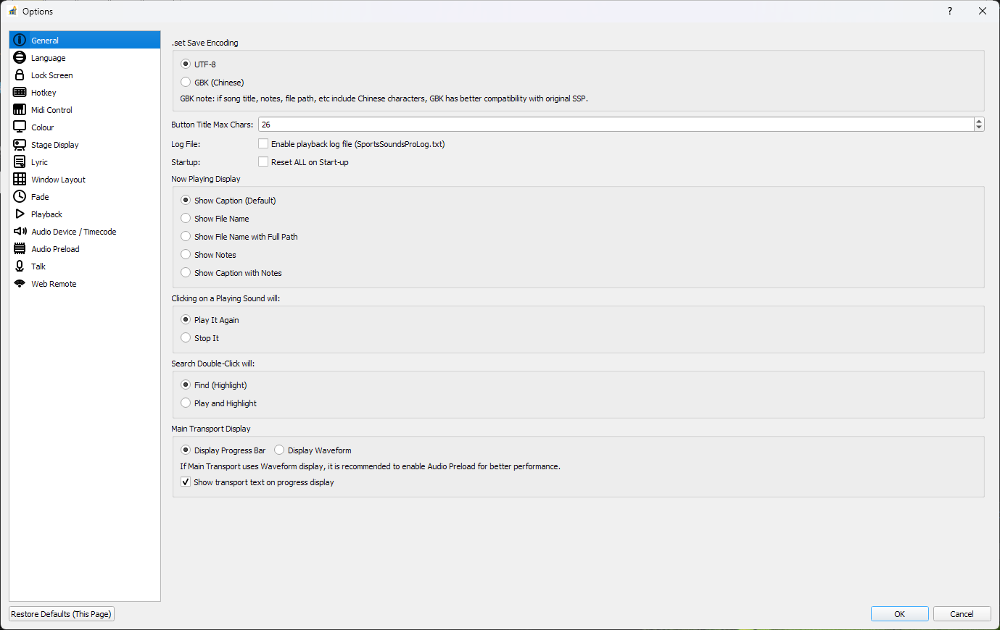

- `Button Title Max Chars`
  - Controls UI truncation length for sound button titles in the main grid.
- `Enable playback log file (SportsSoundsProLog.txt)`
  - Enables writing playback log events to the SSP-style log file.
- `Reset ALL on Start-up`
  - Resets runtime state at startup (play-state style reset workflow).
- `Now Playing Display`
  - `Show Caption (Default)`: uses button title.
  - `Show File Name`: uses filename stem.
  - `Show File Name with Full Path`: uses full path.
  - `Show Notes`: uses notes field.
  - `Show Caption with Notes`: combines caption and notes when both exist.
- `.set Save Encoding`
  - `UTF-8`: default cross-platform encoding.
  - `GBK (Chinese)`: better compatibility with original SSP when set content contains Chinese characters.
- `Clicking on a Playing Sound will`
  - `Play It Again`: retriggers behavior.
  - `Stop It`: clicking currently playing slot stops that slot.
- `Search Double-Click will`
  - `Find (Highlight)`: navigates/highlights only.
  - `Play and Highlight`: navigates and triggers playback.
- `Main Transport Display`
  - `Display Progress Bar` or `Display Waveform`.
  - `Show transport text on progress display`: toggles text overlay (`%`, and cue in/out text in audio-file mode).

## Language

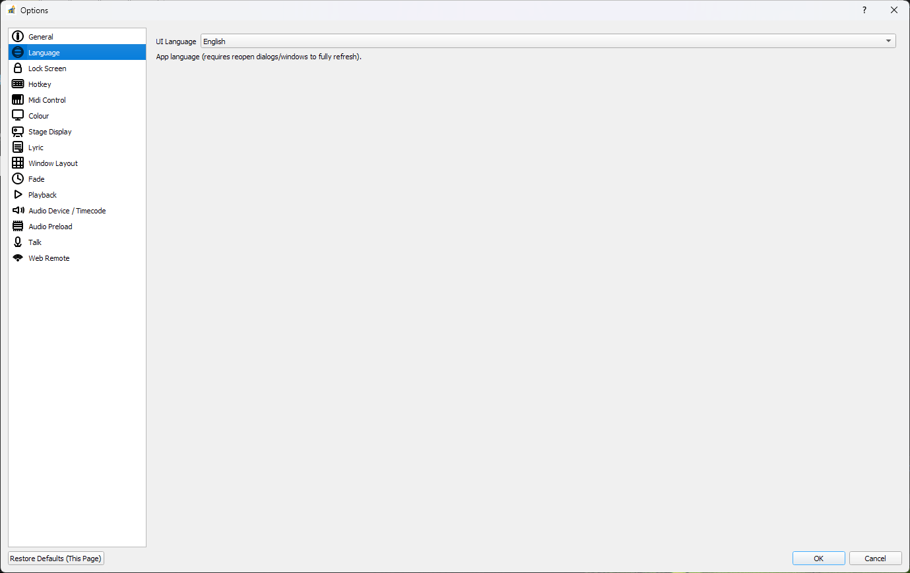

- `UI Language`
  - Switches UI localization (`English` / `Chinese (Simplified)`).
  - Existing windows may require reopen/refresh to fully redraw localized strings.

## Lock Screen

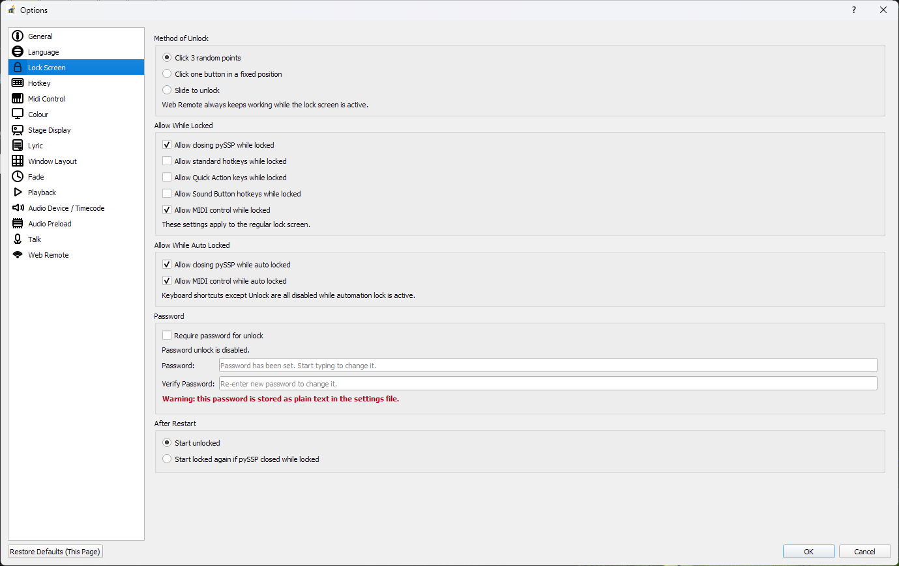

- `Method of Unlock`
  - `Click 3 random points`
  - `Click one button in a fixed position`
  - `Slide to unlock`
- `Allow While Locked` (normal lock only)
  - Allow quit.
  - Allow system hotkeys.
  - Allow quick-action hotkeys.
  - Allow sound-button hotkeys.
  - Allow MIDI control.
- `Allow While Auto Locked` (automation lock mode)
  - Allow quit.
  - Allow MIDI control.
  - Keyboard shortcuts other than unlock are blocked during automation lock.
- `Require password for unlock`
  - Enables password-gated unlock.
  - Password is stored in plaintext in settings.
  - If password fields are blank when saving, existing stored password is preserved.
- `After Restart`
  - `Start unlocked`
  - `Start locked again if pySSP closed while locked`

Runtime behavior details:

- While locked, allowed input sources are filtered by source type (`system`, `quick_action`, `sound_button`, `midi`).
- While automation lock is active, Web Remote/API control remains active.
- API unlock can release automation lock.

## Hotkey

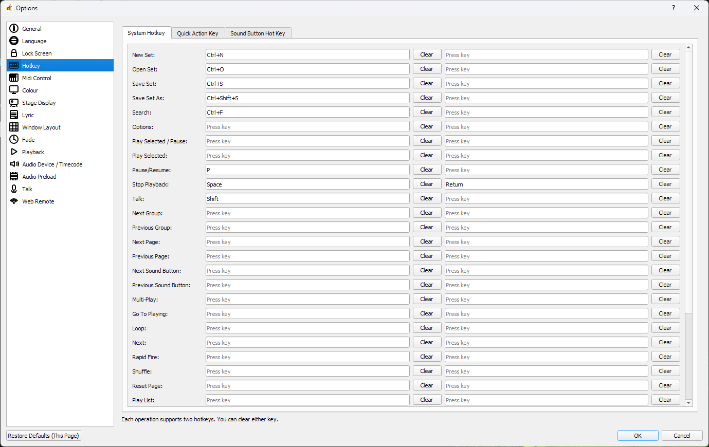

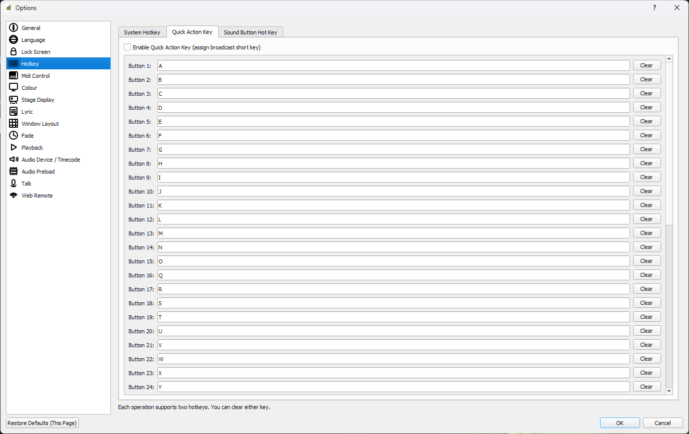

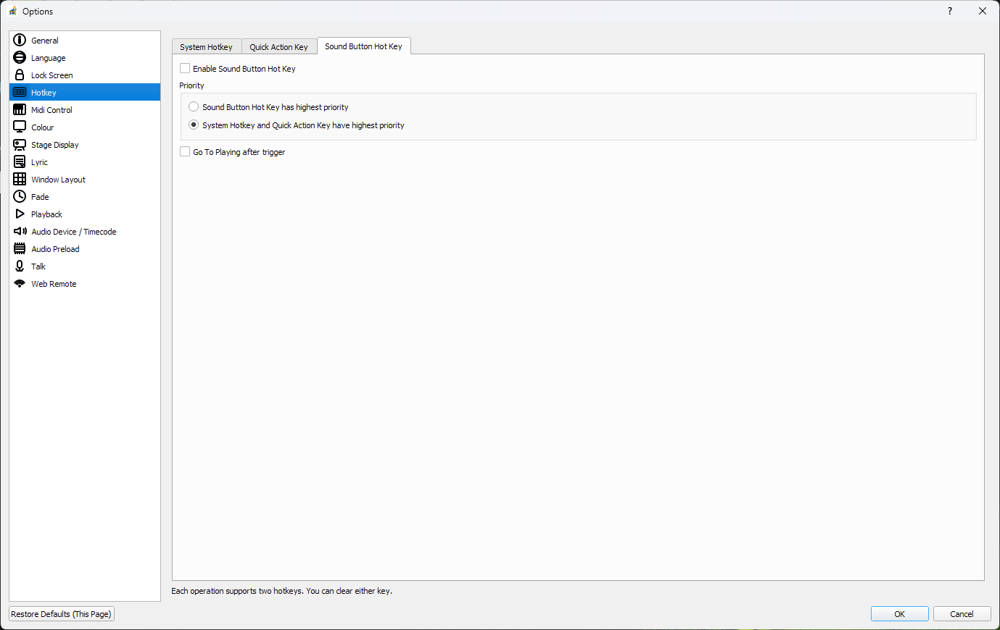

- `System Hotkey`
  - Each action supports two assignable keybindings.
  - Duplicate key conflicts are blocked at save time.
  - Actions available:
    - New Set, Open Set, Save Set, Save Set As
    - Search, Options
    - Play Selected / Pause, Play Selected, Pause/Resume, Stop Playback
    - Talk
    - Next/Previous Group, Next/Previous Page, Next/Previous Sound Button
    - Multi-Play, Go To Playing, Loop, Next, Rapid Fire, Shuffle, Reset Page, Play List
    - Fade In, X (Cross Fade), Fade Out
    - Mute, Volume Up, Volume Down
    - Lock / Unlock, Open / Hide Lyric Navigator
- `Quick Action Key`
  - 48 keys mapped to button indexes.
  - Uses the currently active page context.
  - Can be disabled globally.
- `Sound Button Hot Key`
  - Enables per-button hotkeys saved in button metadata.
  - Priority mode:
    - `Sound Button Hot Key has highest priority`
    - `System Hotkey and Quick Action Key have highest priority`
  - `Go To Playing after trigger`: auto-navigates to triggered playing slot location.

## MIDI Control

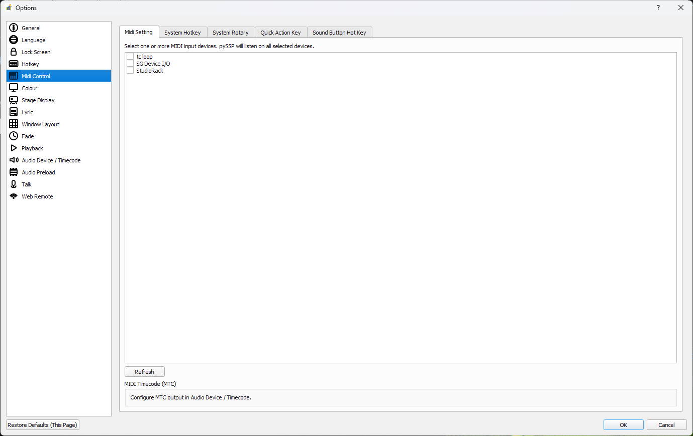

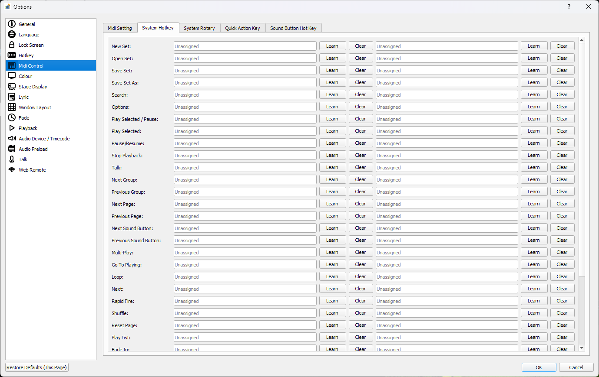

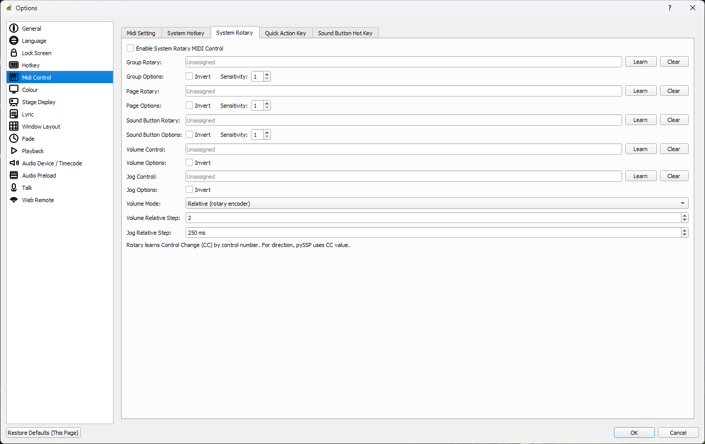

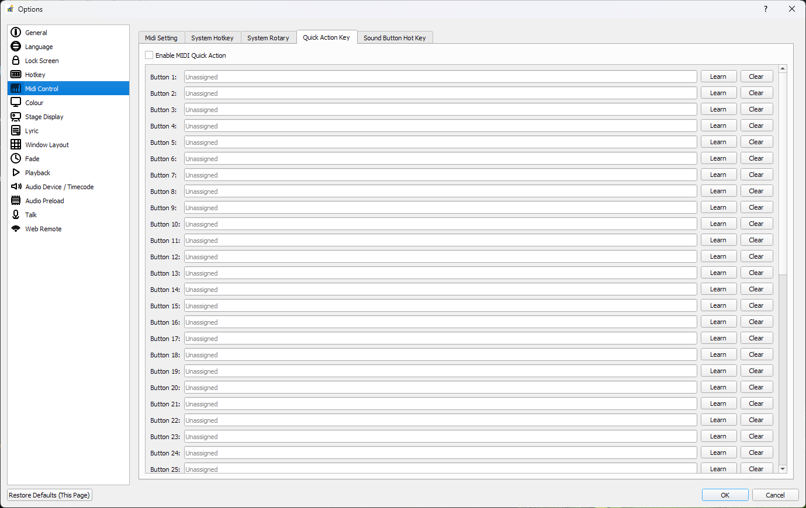

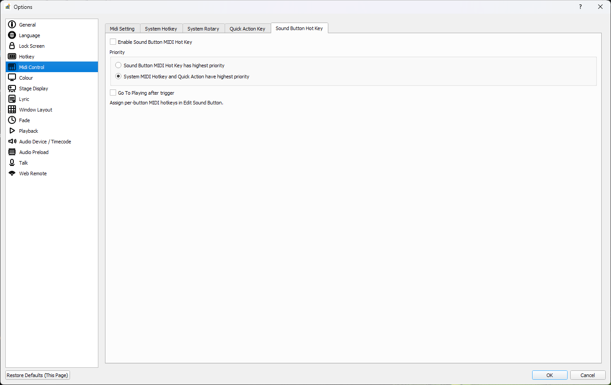

- `Midi Setting`
  - Select multiple MIDI input devices.
  - Refresh device list.
  - Device used by MTC output is blocked from input selection to avoid conflicts.
- `System Hotkey`
  - MIDI equivalent of the keyboard system-hotkey action list (two bindings per action).
  - Conflicts are validated before save.
- `System Rotary`
  - Global enable switch.
  - Bind rotary sources for: Group, Page, Sound Button selection, Jog, Volume.
  - Per-control invert and sensitivity.
  - Volume mode:
    - `Relative (rotary encoder)`
    - `Absolute (slider/fader)`
  - Relative steps for volume and jog.
- `Quick Action Key`
  - 48 MIDI bindings for quick actions.
  - Learn/Clear supported per row.
- `Sound Button Hot Key`
  - MIDI per-button hotkey enable and priority behavior (same model as keyboard sound-button hotkeys).
  - Optional `Go To Playing after trigger`.

## Colour

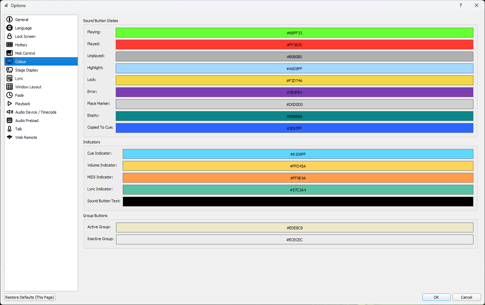

- `Sound Button States`
  - Configurable colors for: Playing, Played, Unplayed, Highlight, Lock, Error, Place Marker, Empty, Copied To Cue.
- `Indicators`
  - Cue indicator, volume indicator, MIDI indicator, lyric indicator.
  - Sound button text color.
- `Group Buttons`
  - Active group color and inactive group color.

## Stage Display

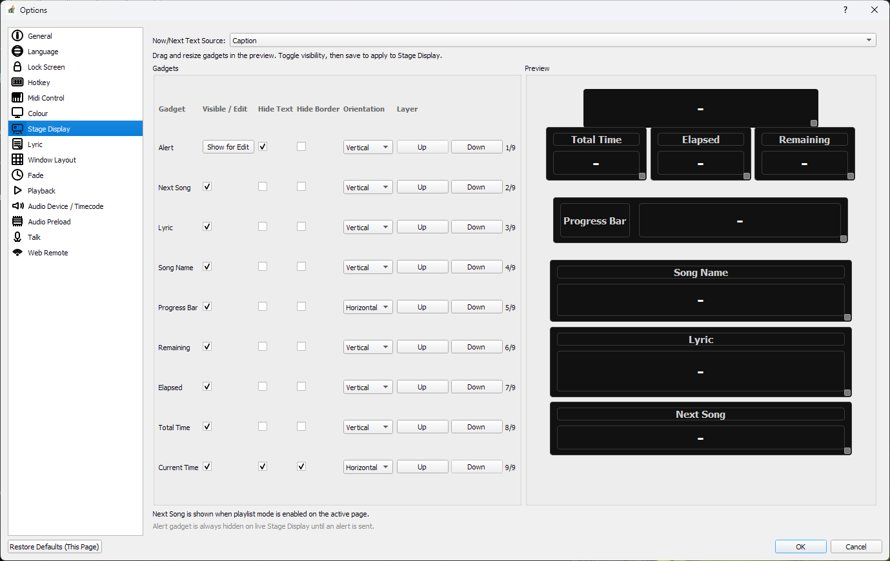

- `Now/Next Text Source`
  - `Caption`, `Filename`, or `Note`.
- Gadget layout editor
  - Gadgets: Current Time, Alert, Total Time, Elapsed, Remaining, Progress Bar, Song Name, Lyric, Next Song.
  - Per-gadget controls:
    - Visible/Edit toggle
    - Hide Text
    - Hide Border
    - Orientation (horizontal/vertical)
    - Layer ordering (`Up`/`Down`)
  - Drag/resize in preview is persisted.
- Runtime notes
  - `Next Song` is only meaningful when playlist logic has a next candidate.
  - `Alert` gadget is hidden on live stage output until alert text is sent.

## Lyric

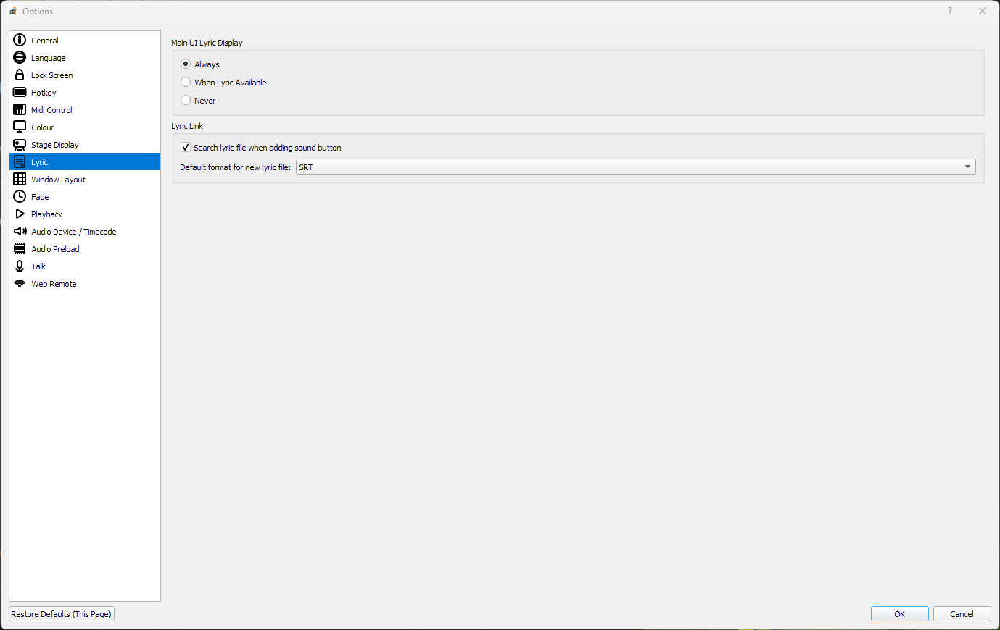

- `Main UI Lyric Display`
  - `Always`: lyric row is visible even if empty/status text.
  - `When Lyric Available`: lyric row visible only with non-empty lyric text.
  - `Never`: lyric row and related lyric controls hidden on main UI.
- `Search lyric file when adding sound button`
  - Enables automatic lyric-file lookup during sound assignment flow.
- `Default format for new lyric file`
  - Chooses new lyric editor/export default (`SRT` or `LRC`).

## Window Layout

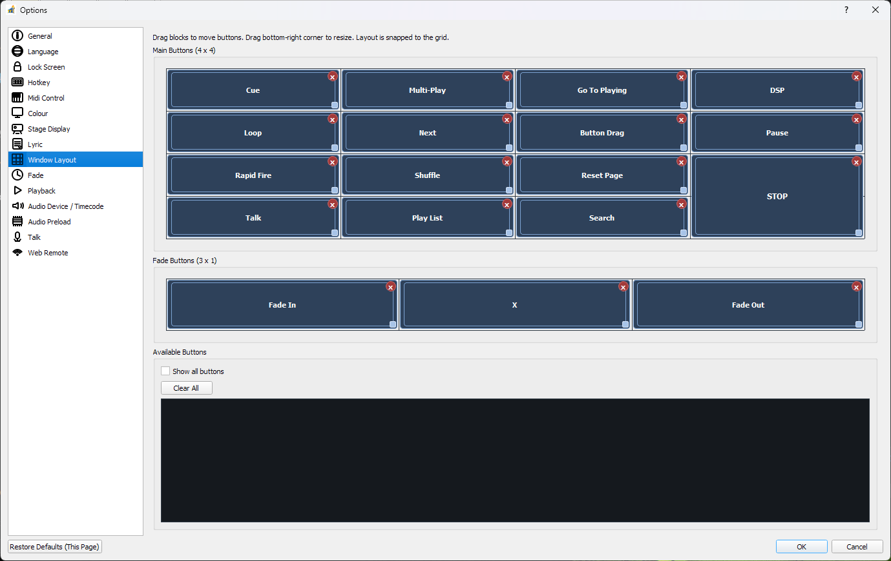

- Main/Fade control layout editors
  - `Main Buttons` on `4 x 4` grid.
  - `Fade Buttons` on `3 x 1` grid.
- `Available Buttons`
  - Drag controls back into layouts.
  - `Show all buttons` allows duplicate placements (cloned controls).
  - `Clear All` removes current placements.

Runtime behavior details:

- Layout is snapped to grid.
- Cloned controls mirror the primary control state and trigger the same handler.

## Fade

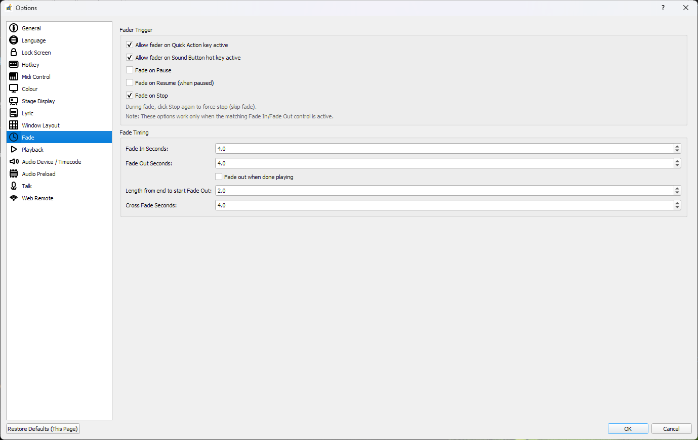

- `Fader Trigger`
  - `Allow fader on Quick Action key active`
  - `Allow fader on Sound Button hot key active`
  - `Fade on Pause`
  - `Fade on Resume (when paused)`
  - `Fade on Stop`
- `Fade Timing`
  - `Fade In Seconds`
  - `Fade Out Seconds`
  - `Fade out when done playing`
  - `Length from end to start Fade Out` (enabled only when fade-out-on-end is enabled)
  - `Cross Fade Seconds`

Runtime behavior details:

- Trigger options require relevant Fade mode buttons (`Fade In`/`Fade Out`/`X`) to be active.
- During stop fade, pressing `STOP` again forces immediate stop.

## Playback

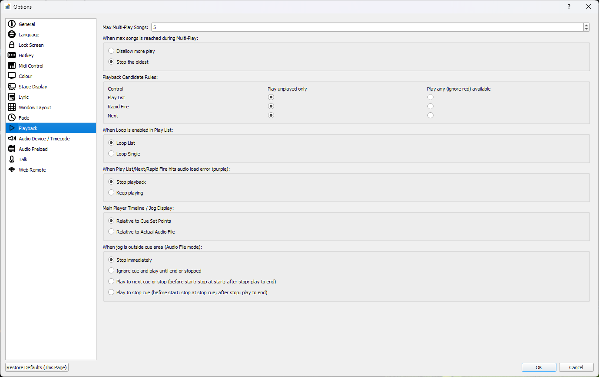

- `Max Multi-Play Songs`
  - Upper bound on simultaneous active tracks.
- `When max songs is reached during Multi-Play`
  - `Disallow more play`
  - `Stop the oldest`
- `Playback Candidate Rules` for `Play List`, `Rapid Fire`, `Next`
  - `Play unplayed only`
  - `Play any (ignore red) available`
- `When Loop is enabled in Play List`
  - `Loop List` or `Loop Single`.
- `When Play List/Next/Rapid Fire hits audio load error (purple)`
  - `Stop playback` or `Keep playing`.
- `Main Player Timeline / Jog Display`
  - `Relative to Cue Set Points` or `Relative to Actual Audio File`.
- `When jog is outside cue area (Audio File mode)`
  - `Stop immediately`
  - `Ignore cue and play until end or stopped`
  - `Play to next cue or stop`
  - `Play to stop cue or end`

## Audio Device / Timecode

The screenshot above includes the Timecode timeline mode options (`Cue Set Points` / `Actual Audio File`) and related toggles.

- `Audio Playback`
  - Playback device selection and device refresh.
- `Timecode Mode`
  - `All Zero`
  - `Follow Media/Audio Player`
  - `System Time`
  - `Pause Sync (Freeze While Playback Continues)`
- `Timecode Display Timeline`
  - `Relative to Cue Set Points` or `Relative to Actual Audio File`
  - `Enable soundbutton timecode offset`
  - `Respect soundbutton timecode display timeline setting`
- `SMPTE Timecode (LTC)`
  - Output device target (follow playback/default/none/specific)
  - Frame rate
  - Sample rate
  - Bit depth
- `MIDI Timecode (MTC)`
  - MIDI output device
  - MTC frame rate
  - Idle behavior (`keep_stream` or `allow_dark`)

## Audio Preload

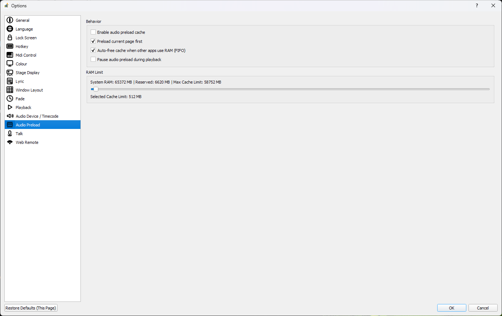

- `Enable audio preload cache`
  - Enables RAM audio cache policy.
- `Preload current page first`
  - Queues current-page assets for preload priority.
- `Auto-free cache when other apps use RAM (FIFO)`
  - Allows cache eviction under memory pressure.
- `Pause audio preload during playback`
  - Temporarily pauses preload jobs while playback is active.
- `Selected Cache Limit`
  - RAM cap slider (step-based, bounded by computed system limits).

## Talk

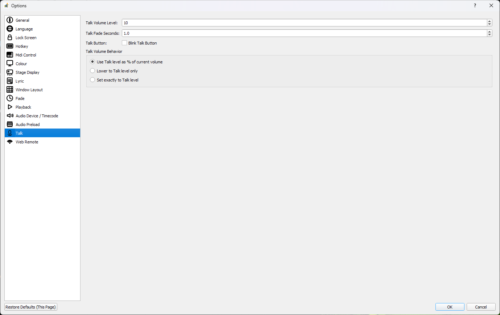

- `Talk Volume Level`
  - Target level used by talk mode behavior.
- `Talk Fade Seconds`
  - Fade time used when talk mode toggles volume.
- `Blink Talk Button`
  - Visual blinking state for Talk control while active.
- `Talk Volume Behavior`
  - `Use Talk level as % of current volume`
  - `Lower to Talk level only`
  - `Set exactly to Talk level`

## Web Remote

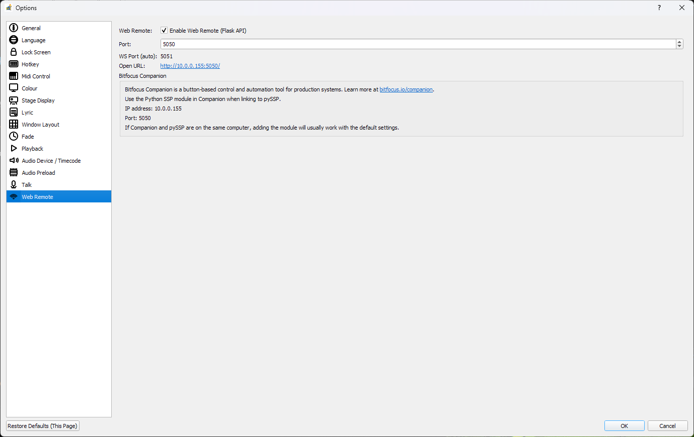

- `Enable Web Remote (Flask API)`
  - Starts/stops local HTTP server and WebSocket API server.
- `Port`
  - HTTP/Web Remote port (`1..65534`).
- `WS Port (auto)`
  - Auto-derived as `port + 1`.
- `Open URL`
  - Displays clickable URL based on detected local IP and configured port.
- `Bitfocus Companion` section
  - Shows module/setup guidance and effective host/port.

Runtime behavior details:

- If HTTP or WS port is already occupied by another process, startup is blocked and warning banner is shown.
