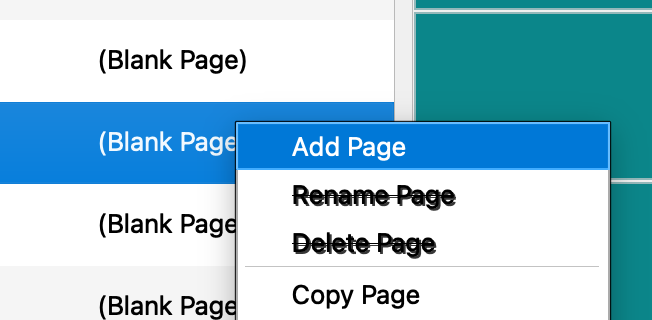
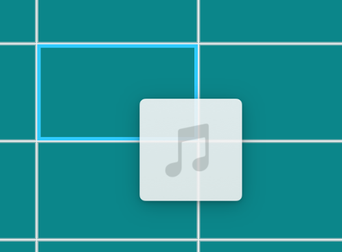

# Startup and Getting Started

pySSP can open a non-blocking **Getting Started** window after the main window finishes loading.

## When It Opens

The window opens automatically when:

- `settings.ini` was not found at launch
- pySSP detects an updated version or build at startup

You can also open it manually from:

- `Help > Getting Started`

## What It Shows

The Getting Started flow includes:

- a welcome page with splash art, version, and build
- a beta warning page for beta builds
- a quick setup page showing how to add a page and drag a file onto a sound button
- an audio-device page with a shortcut into `Setup > Options > Audio Device & Timecode`
- a final page with links for release notes, docs, options, and close

## First Sound Workflow

The basic setup flow is:

1. Add a page.
2. Drag an audio file to a sound button.
3. Set the audio output device under `Setup > Options > Audio Device & Timecode`.

## Images

Add page:

Drag file to sound button:

