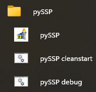

# Troubleshooting

Use this page for common startup and diagnostics issues on both Windows and macOS.

## Startup Options

pySSP commonly ships with three launch paths:

- Normal start: runs pySSP with no extra flags.
- Clean start: runs pySSP with `--cleanstart`.
- Debug mode: runs pySSP with `-debug` (or `--debug`).

## What CleanStart Means

`CleanStart` runs pySSP with the clean-start flag.

Windows:

- Source run script: `run_ssp_cleanstart_venv.bat`
  - Executes: `python main.py --cleanstart`
- Packaged run script: `pySSP_cleanstart.bat`
  - Executes: `pySSP.exe --cleanstart`

macOS:

- Packaged launcher app: `pySSP_cleanstart.app`
  - Executes main app with: `--cleanstart`
- Terminal equivalent:
  - `python main.py --cleanstart`

Use this when settings are corrupted or UI/runtime behavior is broken by previous config.

Important:

- It resets app settings state (same meaning as the `--cleanstart` CLI flag).
- Your `.set` files and media files are not deleted by this flag.

## What Debug Mode Means

`Debug Mode` runs pySSP with the debug flag.

Windows:

- Packaged run script: `pySSP_debug.bat`
  - Executes: `pySSP.exe -debug`

macOS:

- Packaged launcher app: `pySSP_debug.app`
  - Executes main app with: `-debug`
  - Usually launches in Terminal so diagnostic output is visible.
- Terminal equivalent:
  - `python main.py -debug`

Use this when you need more diagnostic output to investigate startup/runtime problems.

Important:

- It enables debug-mode logging/diagnostic behavior (same meaning as `-debug` / `--debug` CLI flags).
- It is for troubleshooting; normal operation should use the standard launcher.

## Quick Recovery Flow

1. Close pySSP.
2. Run `CleanStart` once.
3. If issue remains, run `Debug Mode` and capture the error/log output.
4. Re-test with a known-good `.set` to isolate whether the issue is config-related or set-specific.
