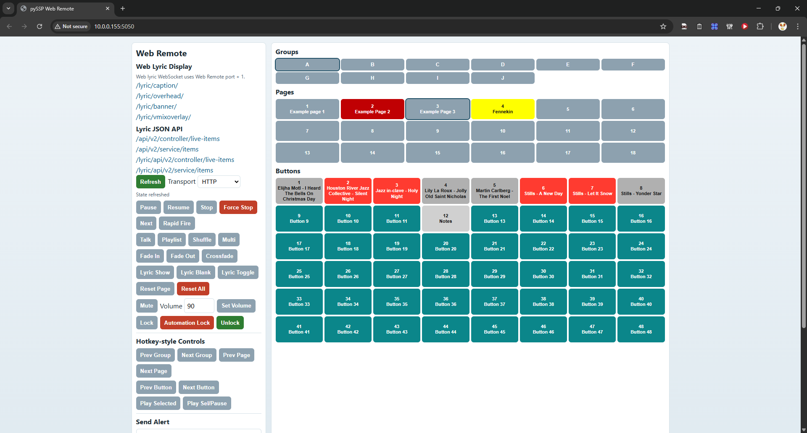
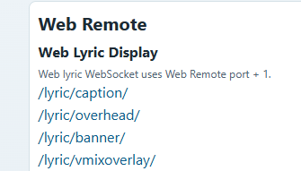
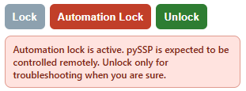
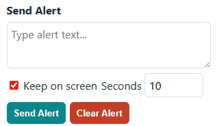

# pySSP Web Remote API

> ## Security Notice
> - pySSP is not built with security as a primary design goal.
> - Use Web Remote/API only on trusted local networks (LAN).
> - Set up proper firewall rules and network segmentation.
> - Do not expose pySSP Web Remote/API directly to the public internet.
> - To report a security issue, email `pyssp_security@studenttechsupport.com`.

Base URL: `http://<host-ip>:<port>`

The Web Remote service is controlled from **Options -> Web Remote**:
- Enable/disable Web Remote
- Set listening port
- View the LAN URL to open in browser

The Web Remote browser page now supports selecting transport mode:
- `HTTP` (existing REST calls)
- `WebSocket` (same API paths over WS request/response)

All responses are JSON.

## UI Reference Screenshots

Main Web Remote page:



Lyric links and lyric JSON API links:



Lock / automation lock controls:



Stage alert panel section:



- Success shape:
```json
{
  "ok": true,
  "result": {}
}
```

## WebSocket Transport (API Parity)

WebSocket endpoint:
- `ws://<host-ip>:<ws-port>/ws`
- `wss://<host-ip>:<ws-port>/ws` (if behind TLS proxy)

`ws-port` is the Web Remote port + 1.

Request message:
```json
{
  "type": "api_request",
  "id": "req-1",
  "path": "/api/play/a-1-1",
  "method": "POST",
  "body": {}
}
```

Response message:
```json
{
  "type": "api_response",
  "id": "req-1",
  "status": 200,
  "payload": {
    "ok": true,
    "result": {}
  }
}
```

Notes:
- `path` supports the same HTTP API paths documented below.
- `method` supports `GET` and `POST`.
- `body` is optional and maps to JSON/form-style params used by the HTTP routes.
- Query strings in `path` are also supported (example: `/api/seek?percent=33.5`).
- Error shape:
```json
{
  "ok": false,
  "error": {
    "code": "error_code",
    "message": "Human readable error"
  }
}
```

## Core Control

- `GET /`
  - Browser UI with clickable groups, pages, and buttons plus transport controls.

- `GET/POST /api/health`
- `GET/POST /api/play/<button_id>`
  - Example: `/api/play/a-1-1`
- `GET/POST /api/pause`
  - Pauses active playback. Returns an error if nothing is playing.
- `GET/POST /api/resume`
  - Resumes paused playback. Returns an error if nothing is paused.
- `GET/POST /api/stop`
  - Same behavior as clicking `STOP` in the UI (fade rules apply).
- `GET/POST /api/forcestop`
  - Immediate stop without fade.
- `GET/POST /api/rapidfire`
- `GET/POST /api/playnext`
  - Returns error if not currently playing or no next track is available.

## Toggle/Mode Endpoints

Mode values: `enable`, `disable`, `toggle`

- `GET/POST /api/talk/<mode>`
- `GET/POST /api/vocal-removed/<mode>`
- `GET/POST /api/vocalremoved/<mode>`
  - Alias routes for vocal-removed playback mode.
- `GET/POST /api/playlist/<mode>`
- `GET/POST /api/playlist/shuffle/<mode>`
  - Returns error if playlist is not enabled.
- Alias routes:
  - `GET/POST /api/playlist/enableshuffle`
  - `GET/POST /api/playlist/disableshuffle`
- `GET/POST /api/multiplay/<mode>`
- `GET/POST /api/fadein/<mode>`
- `GET/POST /api/fadeout/<mode>`
- `GET/POST /api/crossfade/<mode>`
- `GET/POST /api/lyric/<mode>`
  - Mode values: `show`, `blank`, `toggle`
  - Controls lyric output visibility for Web Lyric Display and native Qt Lyric Display.

## Navigation/Reset

- `GET/POST /api/goto/<target>`
  - Accepted target formats:
    - `<group>` (example: `a`)
    - `<group>-<page>` (example: `a-1`)
    - `<group>-<page>-<button>` (example: `a-1-1`)
- `GET/POST /api/resetpage/current`
- `GET/POST /api/resetpage/all`
- `GET/POST /api/group/next`
- `GET/POST /api/group/prev`
- `GET/POST /api/page/next`
- `GET/POST /api/page/prev`
- `GET/POST /api/soundbutton/next`
- `GET/POST /api/soundbutton/prev`

## Playback Selection / Volume

- `GET/POST /api/playselected`
  - Mimics the `Play Selected` hotkey behavior.
- `GET/POST /api/playselectedpause`
  - Mimics the `Play Selected / Pause` hotkey behavior.
- `GET/POST /api/volume/<level>`
  - Set master volume, where `level` is `0..100`.
- `GET/POST /api/mute`
  - Mimics the `Mute` hotkey toggle behavior.
- `GET/POST /api/seek/percent/<value>`
  - Seek transport by percentage (`0..100`, supports decimal values).
- `GET/POST /api/seek/time/<value>`
  - Seek transport by time string (`mm:ss`, `mm:ss:ff`, or `hh:mm:ss`).
- `GET/POST /api/seek`
  - Same as above using params:
    - `percent=<0..100>`
    - or `time=<mm:ss | mm:ss:ff | hh:mm:ss>`

## Lock Control

- `GET/POST /api/lock`
  - Enables the normal lock screen.
  - Uses the configured unlock method for local UI unlock.
- `GET/POST /api/automation-lock`
- `GET/POST /api/automation_lock`
  - Enables automation lock.
  - Automation lock is intended for remote/API control scenarios.
  - On the local pySSP UI, automation lock shows an extra red warning box.
  - Local unlock from the pySSP UI requires typing `sure to unlock`.
  - If password unlock is enabled, local automation unlock also requires the password.
  - While automation lock is active, Web Remote and API control still work.
- `GET/POST /api/unlock`
  - Releases either normal lock or automation lock.
  - Web API unlock bypasses the local unlock method and bypasses password prompts.

## Stage Alert

- `GET/POST /api/alert`
  - Send alert text to Stage Display.
  - Supported params (query, form, or JSON):
    - `text` (required): alert text
    - `keep` (optional): `true/false` (default `true`)
    - `seconds` (optional): `1..600`, used only when `keep=false`
    - `mode` (optional): `disable` to clear alert
    - `clear` (optional): `true` to clear alert
- `GET/POST /api/alert/clear`
  - Shortcut to clear current alert.

## Query Endpoints

- `GET /api/query`
  - Returns current high-level app state.
  - Includes:
    - `screen_locked`: `true` when pySSP is currently locked
    - `automation_locked`: `true` when the current lock is automation lock
    - `vocal_removed_active`: `true` when vocal-removed playback mode is enabled
  - Includes `playing_tracks` array with active song title(s), button id(s), and remaining time (`remaining`, `remaining_ms`).
- `GET /api/query/button/<button_id>`
  - Example: `/api/query/button/a-1-1`
- `GET /api/query/pagegroup/<group>`
  - Example: `/api/query/pagegroup/a`
  - Each page entry includes `page_name` and `page_color`.
- `GET /api/query/page/<group>-<page>`
  - Example: `/api/query/page/a-1`
  - Includes page metadata (`page_name`, `page_color`) and `buttons` array with each button state (assigned/locked/marker/missing/played/is_playing/title).
  - Marker buttons include `marker_text` so the web remote can display place marker text.

## ID Format

- Button ID format: `<group>-<page>-<button>`
- Group: `A`..`J` (also `Q` for cue page)
- Page: `1..18` (`Q` supports only page `1`)
- Button: `1..48`

## Example Calls

```bash
curl http://192.168.1.10:5050/
curl http://192.168.1.10:5050/api/play/a-1-1
curl http://192.168.1.10:5050/api/talk/toggle
curl http://192.168.1.10:5050/api/vocal-removed/toggle
curl http://192.168.1.10:5050/api/resume
curl http://192.168.1.10:5050/api/playlist/enable
curl http://192.168.1.10:5050/api/playlist/shuffle/enable
curl http://192.168.1.10:5050/api/playnext
curl http://192.168.1.10:5050/api/lock
curl http://192.168.1.10:5050/api/automation-lock
curl http://192.168.1.10:5050/api/unlock
curl http://192.168.1.10:5050/api/query
```
